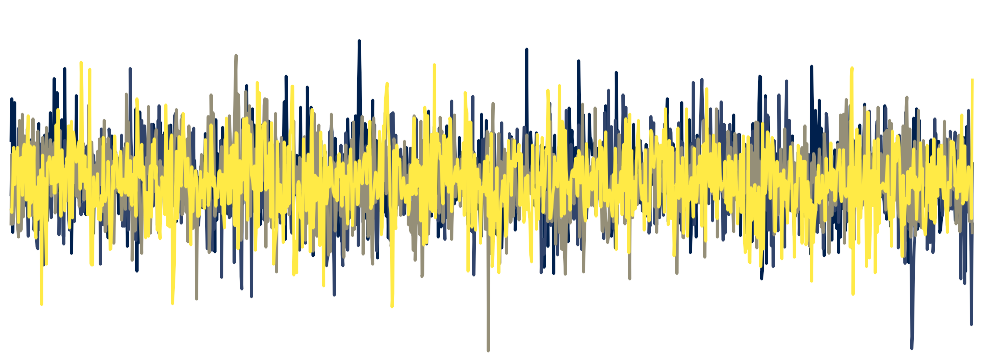

```{r, layout="l-screen-inset", echo=FALSE}



```

## Manuscripts

Aristodemou, M., Kievit, R., Murray, A. L., Eisner, M., Ribeaud, D., & Fried, E. I.
(2023). Common cause vs dynamic mutualism: an empirical comparison of two theories
of psychopathology in two large longitudinal cohorts. Clinical Psychological Science, doi:
https://doi.org/10.1177/21677026231162814

Aristodemou, M. E., & Fried, E. I. (2020). Common Factors and Interpretation of the p
Factor of Psychopathology. Journal of the American Academy of Child and Adolescent
Psychiatry, 59(4), 465-466. doi: 10.1016/j.jaac.2019.07.953

Aristodemou, M., Judd, N., Klingberg, T., & Kievit, R. (2024) You Could do Better
Tomorrow: Nonverbal reasoning speed fluctuates across days, working memory is stable.
https://lifespancognitivedynamics.com/papers/DayVar_Preprint_MEA.pdf

Judd, N., Aristodemou, M., & Kievit, R. (2023). Cognitive variability is ubiquitous and
distinct from mean performance across eleven tasks with over 7 million trials.
doi: 10.31234/osf.io/b29rn

Aristodemou, M., Rommelse, N., & Kievit, R. (2022). Attentiveness modulates reaction-time variability: findings from a population-based sample of 1032 children.
doi: 10.31234/osf.io/j2n5w

## Blog

What does your ex have in common with magic cats? Autoregression in 2 short
stories (2023)
https://lifespancognitivedynamics.com/posts/2023-10-28-Autoregression-And-Cats/

What is parsimony worth? (2022)
https://lifespancognitivedynamics.com/posts/2022-01-17-What-Is-Parsimony-Worth/

## Tutorials

Dynamic Structural Equation Modeling using Stan
Materials: https://github.com/mearistodemou/DSEM_workshop

