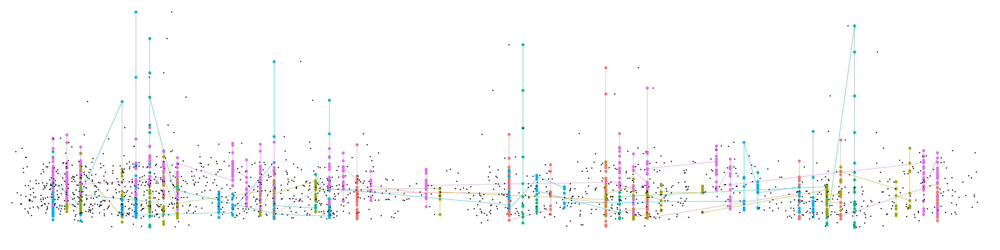
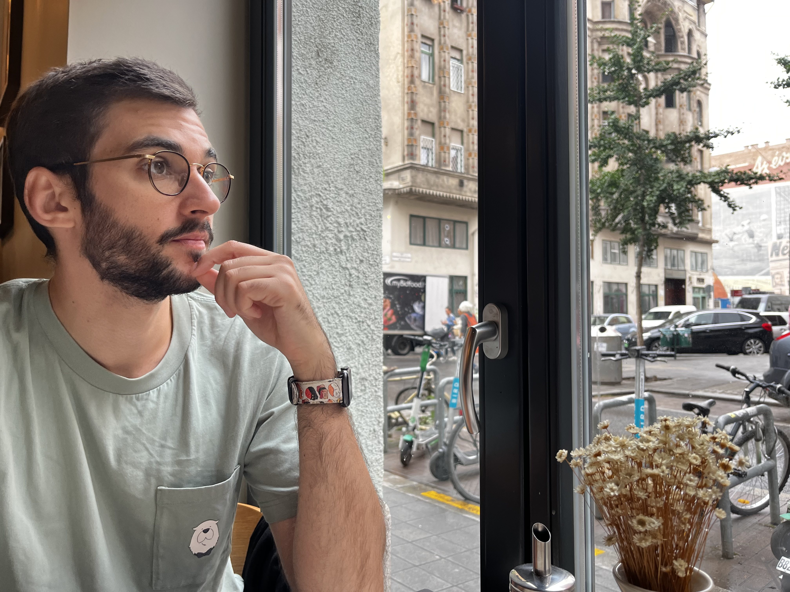

```{r, layout="l-screen-inset", echo=FALSE}



```

## Michael E. Aristodemou

::: {.floatting}

```{r out.width='40%', out.extra='style="float:left; padding:20px"', echo=FALSE}

```

I'm a PhD candidate at the [Lifespan Cognitive Dynamics lab](https://lifespancognitivedynamics.com) at the Donders Institute for Brain, Cognition, and Behaviour. My work uses dynamic properties of human behavior and neural activity to understand psychological attributes. This ranges from studying the [longitudinal structure of mental disorders](https://journals.sagepub.com/doi/full/10.1177/21677026231162814), to zooming into the [rapid fluctuations](https://osf.io/preprints/psyarxiv/j2n5w) that are inherent in people's cognitive performance, to testing brain-behavior coupling using joint models. I enjoy translating theories into statistical models that can be tested against empirical data. This leads me to delve into wide and varied statistical analysis packages (Stan, brms, lme4, lavaan) across multiple programming languages (R, Python, Mplus) and data modalities (behavioral time series, functional MRI, EEG). My attempts to embrace the truly interdisciplinary nature of psychological science has led me to hop around multiple subfields and meet many inspiring collaborators. Some of the projects that I am involved in are below:

-   Using complexity science indices to predict diagnostic status from cognitive performance (clinical/cognitive science)
-   Examining the longitudinal interplay between ADHD, sleep, and white matter (clinical/neuroscience)
-   Examining the structure of cognitive fluctuations across timescales and tasks (cognitive science)
-   Testing theoretical brain-behavior links between neural noise and cognitive performance using joint models (neuroscience)
-   Testing the malleability of cognitive fluctuations using a pharmaco-PET-fMRI design (neuroscience)
-   Testing individual differences in reward sensitivity using data from a large mathematics adaptive learning system (education science)
-   Enhancing model efficiency by using different sampling algorithms for parameter chunks (psychometrics)
-   Developing Dynamic Structural Equation Models in Stan (psychometrics)
:::


